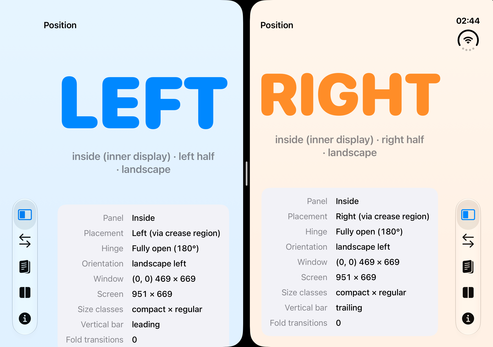
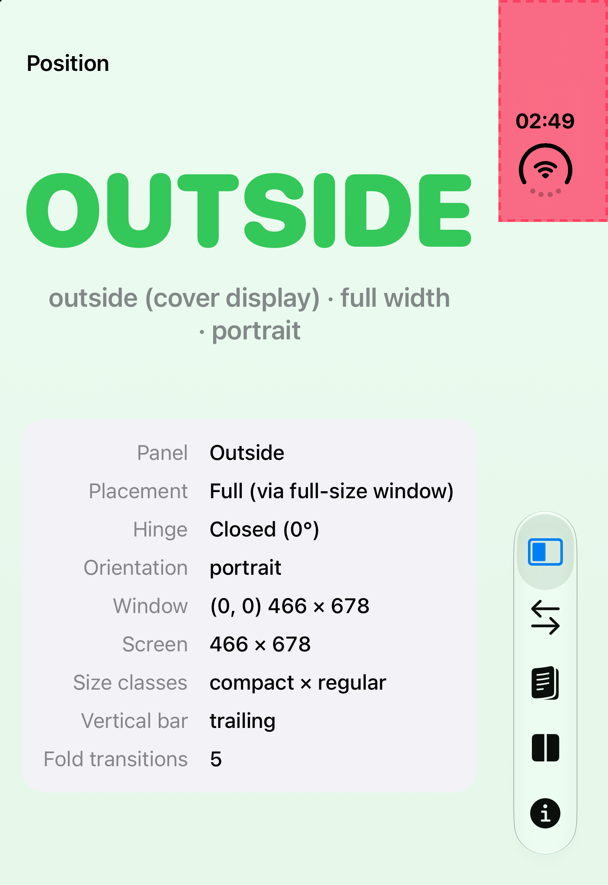
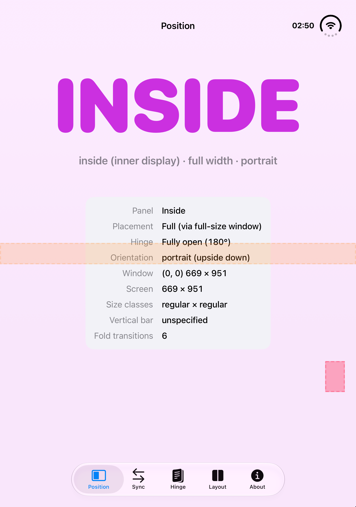
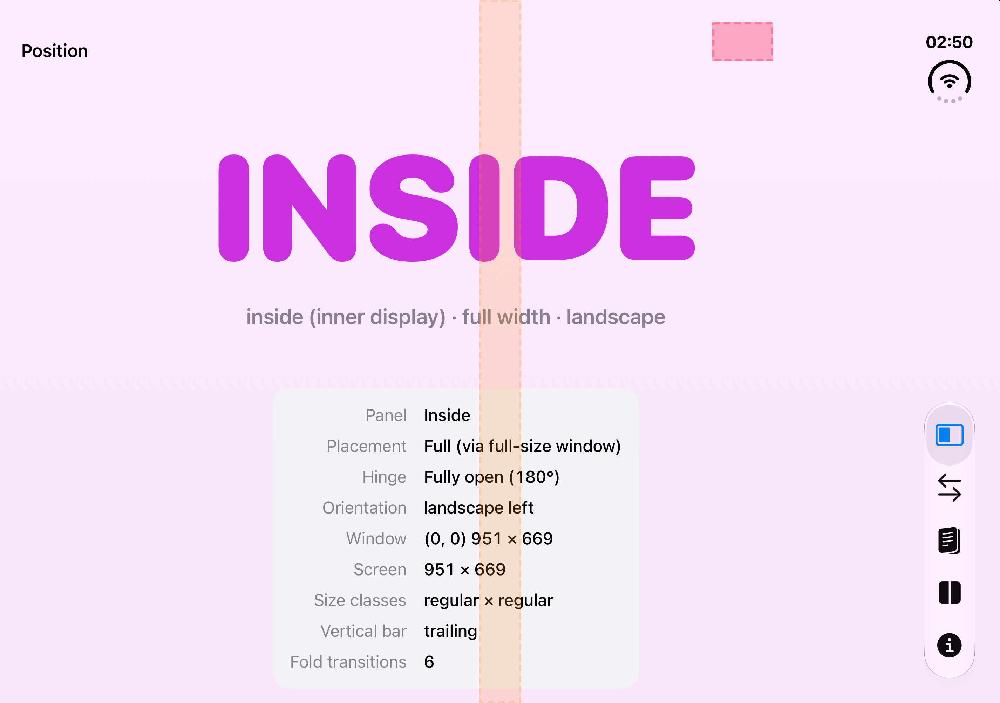
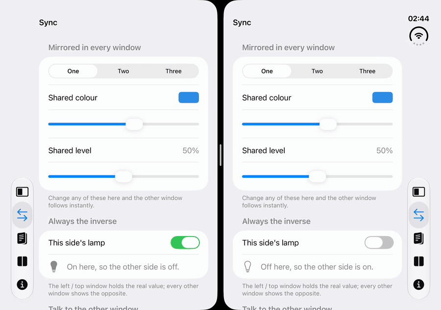
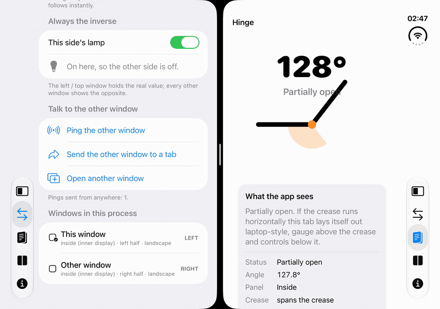
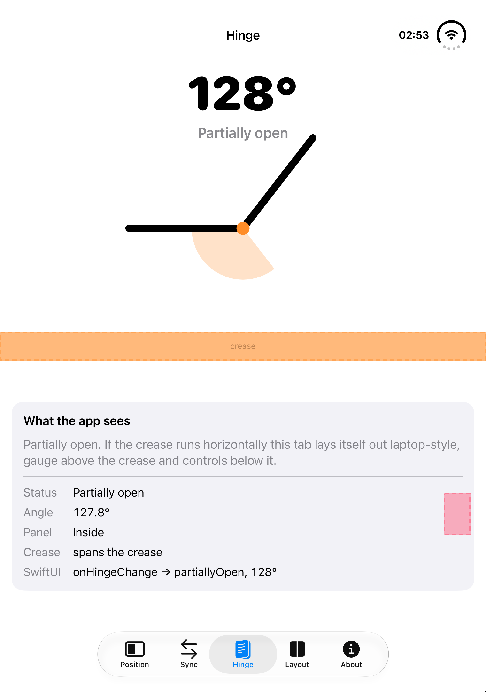
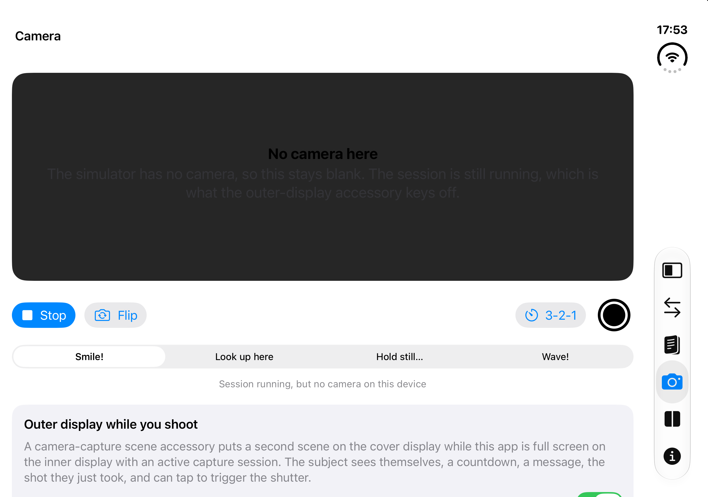
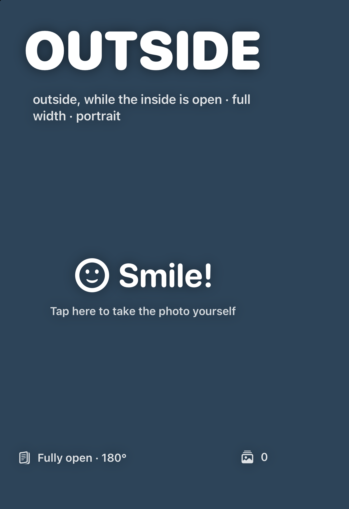
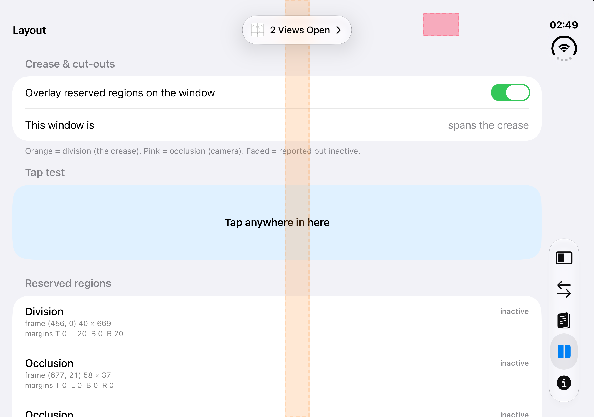

# duo-demo

A tiny SwiftUI demo for the **iPhone Duo** (iOS 27.1) that shows what an app can figure out about
*where it is* on a foldable, and how two windows of the same app can talk to each other when they
sit side by side on the inner display.

Everything in it is derived from public iOS 27.1 APIs. Apple gives you the raw signals (hinge
state, reserved regions, traits); the app turns them into plain words like **OUTSIDE**, **LEFT**
and **RIGHT**.

<p align="center">
  
</p>

## What's in it

| Tab | What it shows |
| --- | --- |
| **Position** | Big words: `OUTSIDE` / `INSIDE`, or `LEFT` / `RIGHT` (`TOP` / `BOTTOM` in portrait) when the window is one half of a Split View. Plus how it knows. |
| **Sync** | A segmented picker, a colour and a slider mirrored across every window; a toggle that is always the *inverse* of the other side; ping the other window (it flashes); send the other window to a tab; open another window. |
| **Hinge** | Live hinge status and angle drawn as a gauge. Partially open with a horizontal crease (portrait) lays the tab out laptop-style around the crease. |
| **Camera** | A capture session with preview, flip, shutter and a 3-2-1 countdown. While capturing on the inner display, a **camera-capture scene accessory** puts a second scene on the cover display for the person being photographed: mirrored preview, countdown, a message, the shot they just took, and tap-to-shoot. That scene reports `OUTSIDE`, inside open. |
| **Layout** | The crease and camera cut-outs as reserved regions, overlaid on the window; which side of the crease this window sits on; which side of the crease you tapped; the vertical tab bar edge; safe areas; size classes. |
| **About** | Which API backs each trick. |

## Outside, inside, left, right

| Cover display (closed) | Inner display (open, portrait) |
| --- | --- |
|  |  |

Inner display, landscape, full width:



How the words are derived:

- **Outside vs inside** comes from the hinge. `UIHingeInteraction` (UIKit) or `onHingeChange`
  (SwiftUI) reports `closed`, `partiallyOpen` or `fullyOpen`. Closed means the cover display.
- **Left vs right** is the interesting one. A scene's window is always at (0, 0) in its own
  coordinate space, so you only learn *that* you are a half, not which one. But UIKit reports the
  crease as a reserved region even when it is inactive for your window, sitting on the edge that
  faces the hinge: `frame (456, 0) 14 × 669` in a 469-point-wide left window, `frame (0, 0)` in
  the right one. As a second signal, the system moves the vertical tab bar to the edge *away* from
  the crease, so the `verticalBarEdge` trait is `leading` on the left and `trailing` on the right.

## Two windows talking

Both copies are window scenes of one process, so a shared `@Observable` object is all the
communication needed. The inverse toggle just keys one value off which window is the left / top one.



## Hinge



In portrait the crease runs horizontally. Partially open, the Hinge tab puts the gauge above the
crease and the readout below it:



## Outside while the inside is open

While the app is full screen on the inner display with a running `AVCaptureSession`, the system
offers to show a second scene of the app on the cover display: `sceneAccessory` with a
`CameraCaptureAccessory`. It is a separate scene in the same process, so it shares the capture
session and the store. Its own probe sees an open hinge on a 466 × 678 pt screen and says
"outside, while the inside is open".

| Inner display (photographer) | Cover display (subject) |
| --- | --- |
|  |  |

The subject sees themselves mirrored, the countdown, a message picked on the inside ("Smile!",
"Look up here", …), the shot for a couple of seconds after it is taken, and can tap the cover to
start the countdown themselves. This works in the simulator too: an empty running session is
enough to make the accessory available (the simulator just has no camera image).

## Crease and cut-outs

`UIView.reservedRegions(kind:)` (or `GeometryProxy.reservedRegions(kind:)` in SwiftUI) returns the
crease (`.division`) and camera cut-outs (`.occlusion`) with frames and margins. The Layout tab
draws them over the window and tells you which side of the crease a tap landed on.



## APIs used

| Trick | API |
| --- | --- |
| Hinge status and angle | `UIHingeInteraction`, `UIHinge` · SwiftUI `onHingeChange`, `DeviceHinge` |
| Crease and camera cut-outs | `UIView.reservedRegions(kind:options:)` · SwiftUI `GeometryProxy.reservedRegions(kind:)` |
| Vertical tab bar edge | `UITraitCollection.verticalBarEdge`, `systemTraitsAffectingVerticalBarEdge` · SwiftUI `@Environment(\.toolbarVerticalEdge)` |
| Two windows | `UIApplicationSupportsMultipleScenes`, `openWindow`, a shared `@Observable` |
| Second scene on the cover while capturing | SwiftUI `sceneAccessory`, `CameraCaptureAccessory(isEnabled:)`, `onAvailabilityChange` · UIKit `UISceneAccessory.cameraCapture`, `registerSceneAccessory` |
| Panel size cross-check | `UIScreen.bounds` (cover 466 × 678 pt, inner 951 × 669 pt) |

## Run it

```sh
brew install xcodegen   # once
xcodegen generate
open DuoDemo.xcodeproj  # pick the "iPhone Duo" simulator, run
```

Requires Xcode 27.1 (iOS 27.1 SDK and the iPhone Duo simulator). In Device Hub, the buttons at the
bottom fold and unfold the device and rotate it.

To get two windows side by side: unfold, drag the app by its home indicator to one edge of the
screen, then pick the app again on the other half (it is on the second home-screen page). Or use
"Open another window" on the Sync tab and arrange from the app switcher.

## Layout of the code

- `DuoDemo/Model/WindowSnapshot.swift`: everything one window knows about itself.
- `DuoDemo/Model/SharedStore.swift`: state shared by all windows of the process.
- `DuoDemo/Probe/WindowProbe.swift`: the one UIKit view that reads the hinge, reserved regions,
  traits and geometry and publishes a `WindowSnapshot`.
- `DuoDemo/Model/CameraModel.swift`: the capture session (off the main actor) and the camera / accessory state.
- `DuoDemo/Views/OuterAccessoryView.swift`: what the cover display shows while capturing.
- `DuoDemo/Views/*`: the tabs.
- `docs/design.md`: the design brief.
